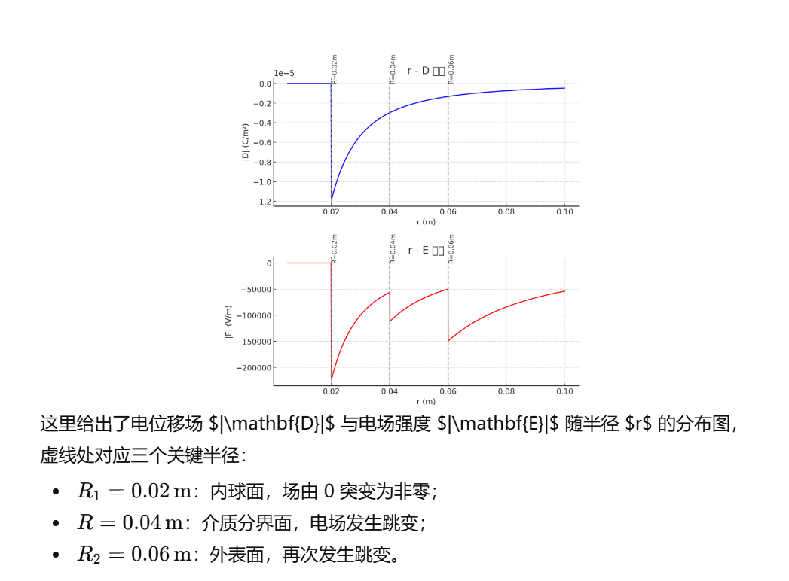

### 2.4

> (1)
>
> 

>  额，不小心用k了，高中写惯了
> 

>
> > 考虑到 $A、B$ 的球对称性，电荷显然均匀分布在其表面上，令$A$ 及 $B$ 内外净电荷分别为 $q_1,q_2,q_3$ 
> > $$
> > \left\{ \begin{gathered}
> >   {\varphi _2} = k\frac{{\left( {{q_1} + {q_2} + {q_3}} \right)}}{{{R_3}}} \hfill \\
> >   {\varphi _1} = k\frac{{{q_1}}}{{{R_1}}} + k\frac{{{q_2}}}{{{R_2}}} + k\frac{{{q_3}}}{{{R_3}}} \hfill \\ 
> > \end{gathered}  \right.
> > $$
> > 此外，对外球壳还有电荷守恒
> > $$
> > {q_2} + {q_3}=0
> > $$
> > 进而解得
> > $$
> > \left\{ \begin{aligned}
> > &  {q_1} = \frac{{{\varphi _2}{R_3}}}{k} \hfill \\
> > &  {q_2} = \left( {\frac{{{\varphi _1}}}{k} - \frac{{{q_1}}}{{{R_1}}}} \right) \cdot \left( {\frac{{{R_3}{R_2}}}{{{R_3} - {R_2}}}} \right) \hfill \\ 
> > &q_3=-q_2
> > \end{aligned}  \right.
> > $$
> > 而电场分布可由高斯定理与导体性质得出
> > $$
> > \left\{ \begin{aligned}
> >   &0&r < {R_1} \hfill \\
> >   &\frac{{{\varphi _2}{R_3}}}{{{r^2}}}&{R_1} < r < {R_2} \hfill \\
> >   &0&{R_2} < r < {R_3} \hfill \\
> >   &\frac{{{\varphi _2}{R_3}}}{{{r^2}}}&r > {R_3} \hfill \\ 
> > \end{aligned}  \right.
> > $$
>
> (2)
>
> > 考虑到导体的静电平衡条件，电荷必须均分布在 $B$ 外侧，电荷量为 $q_1$ 的电荷均匀分布在 $B$ 外侧
> > \[
> > \varphi  = k\frac{{{q_1}}}{{{R_3}}} = {\varphi _2}
> > \]

### 2.5

> (1)
>
> > 令6个版面电荷分别为 $q_1,q_2,q_3,q_4,q_5,q_6$ ，则
> > \[
> > \begin{aligned}
> >   &\left\{ \begin{aligned}
> >   &{q_1} = {q_2} + {q_5} + {q_6} + Q \hfill \\
> >   &{q_6} = {q_1} + {q_2} + Q + {q_5} \hfill \\ 
> > \end{aligned}  \right. \Rightarrow \left\{ \begin{aligned}
> > &  {q_2} + {q_5} =  - Q \hfill \\
> > &  {q_1} = {q_6} = 0 \hfill \\ 
> > \end{aligned}  \right. \hfill \\
> > &  \left\{ \begin{aligned}
> > &  {q_1} + {q_2} + {q_3} = {q_4} + {q_5} + {q_6} \hfill \\
> > &  {q_3} + {q_4} = Q \hfill \\ 
> > \end{aligned}  \right. \Rightarrow \left\{ \begin{aligned}
> >   {q_3} =  - {q_2} \hfill \\
> >   {q_4} = Q + {q_2} =  - {q_5} \hfill \\ 
> > \end{aligned}  \right. \hfill \\
> >   & \Rightarrow \left\{ \begin{aligned}
> >   &{E_{CA}} = \frac{{ - {q_2}}}{{S{\varepsilon _0}}} \hfill \\
> >   &{E_{BC}} = \frac{{ - Q - {q_2}}}{{S{\varepsilon _0}}} \hfill \\ 
> > \end{aligned}  \right. \hfill \\
> >   &{U_0} =  - \int_B^C {E{\text{d}}x}  = \frac{Q}{{3S{\varepsilon _0}}} + \frac{{{q_2}}}{{S{\varepsilon _0}}} \Rightarrow \left\{ \begin{aligned}
> >   &{q_2} = S{\varepsilon _0}{U_0} - \frac{Q}{3} \hfill \\
> >   &{q_5} =  - \frac{{2Q}}{3} - S{\varepsilon _0}{U_0} \hfill \\ 
> > \end{aligned}  \right. \hfill \\
> >    &\Rightarrow \left\{ \begin{aligned}
> >   &{Q_A} = S{\varepsilon _0}{U_0} - \frac{Q}{3} \hfill \\
> >   &{Q_B} =  - \frac{{2Q}}{3} - S{\varepsilon _0}{U_0} \hfill \\ 
> > \end{aligned}  \right. \hfill \\ 
> > \end{aligned} 
> > \]
>
> (2)
>
> > \[
> > {\varphi _C} = {U_0} - \int_{2d/3}^0 {{E_{AC}}{\text{d}}x}  = {U_0} - \frac{{2{q_2}}}{{3S{\varepsilon _0}}} = \frac{{{U_0}}}{3} + \frac{{2Q}}{{9S{\varepsilon _0}}}
> > \]
>
> (3)
>
> > 易知，
> > \[
> > \left\{ \begin{aligned}
> > &  {{q'}_4} = 2{{q'}_3} \hfill \\
> > &  {{q'}_3} + {{q'}_4} = Q \hfill \\
> > &  {{q'}_1} = {{q'}_6} \hfill \\
> > &  {{q'}_2} + {{q'}_3} = {{q'}_4} + {{q'}_5} = 0 \hfill \\
> > &  {{q'}_1} + {{q'}_2} + {{q'}_5} + {{q'}_6} = {q_1} + {q_2} + {q_5} + {q_6} \hfill \\ 
> > \end{aligned}  \right. \Rightarrow \left\{ \begin{aligned}
> > &  {{q'}_1} = {{q'}_6} = 0 \hfill \\
> > &  {{q'}_3} = \frac{1}{3}Q \hfill \\
> > &  {{q'}_4} = \frac{2}{3}Q \hfill \\
> > &  {{q'}_2} =  - \frac{1}{3}Q \hfill \\
> > &  {{q'}_5} =  - \frac{2}{3}Q \hfill \\ 
> > \end{aligned}  \right.
> > \]

### 2.7

> (1)
>
> > 显然，球体上的电荷均分布于球体表面，以无穷远点为电势零点，我们显然能得到
> > \[
> > {V_0} = \frac{1}{{4\pi {\varepsilon _0}}}\left( {\frac{q}{x} + \frac{Q}{R}} \right)
> > \]
> > 而对于场强，由于导体处于静电平衡状态，显然场强为 $0$ 
>
> (2)
>
> > 易知， $P$ 点合场强为 $0$ 合电势与 $V_0$ 一致，因此有
> > \[
> > {E_P} = 0 - \left( { - \frac{1}{{4\pi {\varepsilon _0}}}\frac{q}{{x - R/2}}} \right) = \frac{q}{{4\pi {\varepsilon _0}\left( {x - R/2} \right)}}
> > \]
> > 由 $P$ 指向 $q$ 
> >
> > 电势为
> > \[
> > {V_P} = {V_0} - \frac{1}{{4\pi {\varepsilon _0}}}\frac{q}{{x - R/2}} = \frac{1}{{4\pi {\varepsilon _0}}}\left( {\frac{q}{x} + \frac{Q}{R} - \frac{q}{{x - R/2}}} \right)
> > \]

### 2.8

> (1)
>
> > 考虑接地以及导体的静电平衡， $B$ 内侧电势为 $0$ 。
> >
> > 由于外壳的屏蔽效应，内部电场完全由 $q$ 诱导。
> >
> > 因此，可以计算电场并求出 $A$ 的电势
> > \[
> > \begin{gathered}
> >   \vec E = \frac{1}{{{\varepsilon _0}}}\frac{{q\vec r}}{{4\pi {r^3}}} \hfill \\
> >   V =  - \int_{{R_2}}^{{R_1}} {\vec E{\text{d}}\vec r = \frac{q}{{4\pi {\varepsilon _0}}}\left( {\frac{1}{{{R_1}}} - \frac{1}{{{R_2}}}} \right)}  \hfill \\ 
> > \end{gathered} 
> > \]
>
> (2)
>
> > 对于外部电荷，考虑没有 $q$ 时的情况，显然内部电势处处为 $0$ ，我们取 $O$ 讨论，令外部感应总电荷为 $q_2$ 则
> > \[
> > \frac{1}{{4\pi {\varepsilon _0}}}\left( {\frac{Q}{d} + \frac{{{q_2}}}{{{R_2}}}} \right) = 0
> > \]
> > 对内部电荷，考虑导体内部静电平衡以及高斯定理，易知 $q_1=-q$
> >
> > 因此
> > \[
> > {Q_B} = {q_1} + {q_2} =  - \frac{Q}{2} - q
> > \]
>
> (3)
>
> > 显然，此时整体处于静电平衡状态， $B$ 仅在外壳处有抵消 $Q$ 的电荷 $-\frac{Q}{2}$

### 2.12

> (1)
>
> > \[
> > \begin{gathered}
> >   \iint {{\mathbf{D}}{\text{d}}{\mathbf{a}}} = Q \Rightarrow  \hfill \\
> >   \left| {\mathbf{D}} \right| = \left\{ \begin{gathered}
> >   0,0 < r < {R_1} \hfill \\
> >   \frac{Q}{{4\pi {r^2}}},r > {R_1} \hfill \\ 
> > \end{gathered}  \right. \Rightarrow  \hfill \\
> >   \left| {\mathbf{E}} \right| = \left\{ \begin{gathered}
> >   0,0 < r < {R_1} \hfill \\
> >   \frac{Q}{{24\pi {r^2}{\varepsilon _0}}},{R_1} < r < R \hfill \\
> >   \frac{Q}{{12\pi {r^2}{\varepsilon _0}}},R < r < {R_2} \hfill \\
> >   \frac{Q}{{4\pi {r^2}{\varepsilon _0}}},r > {R_2} \hfill \\ 
> > \end{gathered}  \right. \hfill \\ 
> > \end{gathered}
> > \]
> >
> > 图如下：
> >
> > 
>
> (2)
>
> > \[
> > \begin{gathered}
> >   U =  - \int_{{R_1}}^{{R_2}} {\vec E{\text{d}}\vec r = }  - \left[ {\frac{Q}{{24\pi {\varepsilon _0}}}\left( {\frac{1}{{{R_1}}} - \frac{1}{R}} \right) + \frac{Q}{{12\pi {\varepsilon _0}}}\left( {\frac{1}{R} - \frac{1}{{{R_2}}}} \right)} \right] \hfill \\
> >    =  - \frac{Q}{{12\pi {\varepsilon _0}}}\left( {\frac{1}{{2{R_1}}} + \frac{1}{{2R}} - \frac{1}{{{R_2}}}} \right) \hfill \\ 
> > \end{gathered}
> > \]
>
> (3)
>
> > 可以通过高斯定理取半径为 $r$ 球面 $({R_1} < r < R)$ 计算
> > \[
> > \frac{1}{{4\pi {\varepsilon _0}}}\frac{{Q + {q_1}}}{{{r^2}}} = \frac{Q}{{24\pi {r^2}{\varepsilon _0}}} \Rightarrow {q_1} =  - \frac{5}{6}Q
> > \]

### 2.14

> 考虑高斯定理以及电介质性质，对于 $R_1<r<R_2$我们有
> \[
> \left| {\vec E} \right| = \frac{k}{{{r^2}}} \Rightarrow \left| {{{\vec E}_{{r_1}}}} \right| = \frac{k}{{r_1^2}}
> \]
> 由于电势差不变，我们有
> \[
> \begin{gathered}
> \left| U \right| = k\left( {\frac{1}{{{r_1}}} - \frac{1}{{{r_2}}}} \right) = \frac{{\left| {{E_{{r_1}}}} \right|{r_1}\left( {{r_2} - {r_1}} \right)}}{{{r_2}}} \hfill \\
> \leqslant \left( {\frac{{\left| {{E_{{r_1}}}} \right|\left( {{r_1} + \left( {{r_2} - {r_1}} \right)} \right)}}{{2{r_2}}}} \right) = \frac{{{{\left| {{E_{{r_1}}}} \right|}^2}}}{4} \hfill \\ 
> \end{gathered} 
> \]
> 取等条件为 
> \[
> {r_1} = \frac{{{r_2}}}{2}
> \]

