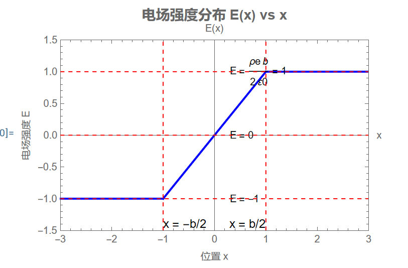
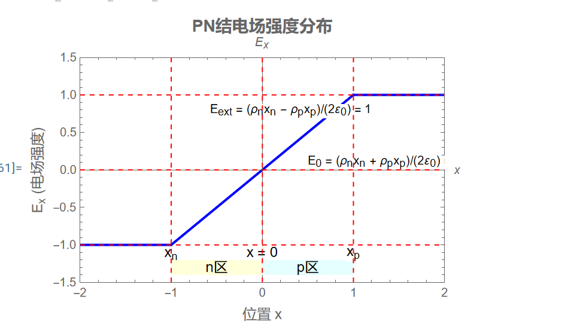

### 1-10

由对称性
$$
E_x=E_y=0
$$
对于 $E_z$
$$
\begin{gathered}
  {E_z} = \frac{{{\sigma _e}}}{{4\pi {\varepsilon _0}}}\int_0^{2\pi } {d\theta } \int_{\frac{\pi }{2}}^\pi  {d\phi } \left[ {\sin \phi \frac{{\cos \phi }}{{{R^3}}}} \right] \hfill \\
   = \frac{{{\sigma _e}}}{{2{\varepsilon _0}}}\int_{\frac{\pi }{2}}^\pi  {d\phi } \left[ {\sin \phi \frac{{\cos \phi }}{{{R^3}}}} \right] \hfill \\
   = \frac{{{\sigma _e}}}{{4{\varepsilon _0}}}\int_{\frac{\pi }{2}}^\pi  {d\phi } \left[ {\sin 2\phi \frac{1}{{{R^3}}}} \right] \hfill \\
   = \frac{{{\sigma _e}}}{{4{\varepsilon _0}{R^3}}} \hfill \\ 
\end{gathered}
$$

### 1-12

我们记
$$
R=0.5\mathrm{m}\quad l=2\mathrm{cm}\quad q=3.12\times 10^{-9}\mathrm{C}\\
\sigma=q/(2\pi R -l)\sim q/2\pi R
$$
我们假定圆环无缺，则又对称性，中心电场强度为 $0$

而缺少部分若存在，由对称性对圆心的电场强度近似为
$$
\begin{gathered}
  {E_y} = \frac{\sigma }{{4\pi R}}\int_{ - \frac{l}{{2\pi R}}}^{\frac{l}{{2\pi R}}} {Rd\theta } \frac{{\cos \theta }}{{{R^2}}} \hfill \\
   = \left. {\frac{\sigma }{{4\pi {R^2}}}\left( {\sin \theta } \right)} \right|_{ - \frac{l}{{2\pi R}}}^{\frac{l}{{2\pi R}}} \hfill \\
   \approx \frac{{\sigma l}}{{4{\pi ^2}{R^3}}} \hfill \\
   \approx \frac{{ql}}{{8{\pi ^3}{R^4}}}\\
   \approx 4.02499\times10^{-12}N/C\hfill \\ 
\end{gathered}
$$
方向指向缺口对面，而缺失则导致剩余部分有一个强度为 $E_y$ 指向缺口处的场强

###1-13

由对称性 $E_x=E_y=0$

对于 $E_z$
$$
  {E_z} = \frac{{Q/(2\pi RL)}}{{4\pi {\varepsilon _0}}}\int_0^L {2\pi Rdz\frac{{L + a - z}}{{{{\left( {\sqrt {{{\left( {L + a - z} \right)}^2} + {R^2}} } \right)}^3}}}}  \hfill \\
   =  - \frac{Q}{{8{\varepsilon _0}\pi L}}\int_0^L {\frac{{d{{\left( {L + a - z} \right)}^2}}}{{{{\left( {\sqrt {{{\left( {L + a - z} \right)}^2} + {R^2}} } \right)}^3}}}}  \hfill \\
   = \frac{Q}{{4{\varepsilon _0}\pi L}}\int_0^L {d\frac{1}{{\sqrt {{{\left( {L + a - z} \right)}^2} + {R^2}} }}}  \hfill \\
   = \frac{Q}{{4{\varepsilon _0}\pi L}}\left( {\frac{1}{{\sqrt {{a^2} + {R^2}} }} - \frac{1}{{\sqrt {{{\left( {L + a} \right)}^2} + {R^2}} }}} \right) \hfill \\ 
$$

### 1-14

由对称性 $E_y=E_z=0$

对于 $E_x$
$$
\begin{gathered}
  {E_x} = {\sigma _e}\int_0^\pi  {R{\text{d}}\theta \left( -{\frac{{\sin \theta }}{{2\pi R{\varepsilon _0}}}} \right)}  \hfill \\
   = \frac{{{\sigma _e}}}{{\pi R{\varepsilon _0}}} \hfill \\ 
\end{gathered}
$$

### 1-15

考虑对称性，$E_y=E_z=0$

对于 $E_x$ 有
$$
  {E_x} = \frac{{{\sigma _e}}}{{4\pi {\varepsilon _0}}}\left( {\int_{_0}^\pi  {a{\text{d}}\theta \left( { - \frac{{\sin \theta }}{{{a^2}}}} \right)}  + 2\int_0^{\frac{\pi }{2}} {\frac{a}{{{{\cos }^2}\theta }}d\theta } \left( { - \frac{{\sin \theta }}{{{{(a/\cos \theta )}^2}}}} \right)} \right) \hfill \\
   = \frac{{{\sigma _e}}}{{4\pi {\varepsilon _0}}}\left( {\int_{_0}^\pi  {{\text{d}}\theta \left( { - \frac{{\sin \theta }}{a}} \right)}  + 2\int_0^{\frac{\pi }{2}} {d\theta } \left( {\frac{{\sin \theta }}{a}} \right)} \right) \hfill \\
   = \frac{{{\sigma _e}}}{{4\pi {\varepsilon _0}}}\left( {\int_{_0}^\pi  {{\text{d}}\theta \left( { - \frac{{\sin \theta }}{a}} \right)}  + \int_0^\pi  {d\theta } \left( {\frac{{\sin \theta }}{a}} \right)} \right) \hfill \\
   = 0 \hfill \\ 
$$

### 1-18

由高斯定理，有
\[
\nabla  \cdot \vec E = 0 \Rightarrow \rho  = 0 \Rightarrow q = 0
\]

## 1-20

由高斯定理，以及氢原子的球对称性，距原子核 $r$ 处的电场方向为原子核指向此处，大小为
\[
  E = \frac{1}{{4\pi {r^2}{\varepsilon _0}}}\left( {q + \int_0^r {{\text{d}}R\int_0^{2\pi } {{\text{d}}\theta \int_0^\pi  {{\text{d}}\phi {R^2}\sin \phi \left( {{\rho _e}\left( r \right)} \right)} } } } \right) \hfill \\
   = \frac{1}{{4\pi {r^2}{\varepsilon _0}}}\left( {q + \int_0^r {{\text{d}}R\int_0^{2\pi } {{\text{d}}\theta \int_0^\pi  {{\text{d}}\phi {R^2}\sin \phi \left( { - \frac{q}{{\pi a_0^3}}{e^{ - 2R/{a_0}}}} \right)} } } } \right) \hfill \\
   = \frac{1}{{4\pi {r^2}{\varepsilon _0}}}\left( {q + 4\int_0^r {{\text{d}}R{R^2}\left( { - \frac{q}{{a_0^3}}{e^{ - 2R/{a_0}}}} \right)} } \right) \hfill \\
   = \frac{1}{{4\pi {r^2}{\varepsilon _0}}}\left( {q + \frac{{2{r^2}q}}{{a_0^2}}{e^{ - 2r/{a_0}}} - 4\int_0^r {{\text{d}}R\frac{{qR}}{{a_0^2}}{e^{ - 2R/{a_0}}}} } \right) \hfill \\
   = \frac{1}{{4\pi {r^2}{\varepsilon _0}}}\left( {q + \frac{{2{r^2}q}}{{a_0^2}}{e^{ - 2r/{a_0}}} + 2r\frac{q}{{{a_0}}}{e^{ - 2r/{a_0}}} - 2\int_0^r {{\text{d}}R\frac{q}{{{a_0}}}{e^{ - 2R/{a_0}}}} } \right) \hfill \\
   = \frac{q}{{4\pi {r^2}{\varepsilon _0}}}\left( {\frac{{2{r^2}}}{{a_0^2}}{e^{ - 2r/{a_0}}} + \frac{{2r}}{{{a_0}}}{e^{ - 2r/{a_0}}} + {e^{ - 2r/{a_0}}}} \right) \hfill \\ 
\]

## 1-25

由高斯定理和对称性，有
\[
E = \frac{1}{{2\pi r{\varepsilon _0}}}\int_0^r {{\text{d}}R\int_0^{2\pi } {{\text{d}}\theta R\left( {{\rho _e}\left( R \right)} \right)} }  \hfill \\
   = \frac{1}{{2\pi r{\varepsilon _0}}}\int_0^r {{\text{d}}R\int_0^{2\pi } {{\text{d}}\theta \frac{{R{\rho _0}}}{{{{\left[ {1 + {{\left( {R/a} \right)}^2}} \right]}^2}}}} }  \hfill \\
   = \frac{1}{{r{\varepsilon _0}}}\int_0^r {{\text{d}}R\frac{{R{\rho _0}}}{{{{\left[ {1 + {{\left( {R/a} \right)}^2}} \right]}^2}}}}  \hfill \\
   = \frac{{{a^2}{\rho _0}}}{{2r{\varepsilon _0}}}\left( {1 - \frac{1}{{1 + {r^2}/{a^2}}}} \right) \hfill \\
\]

## 1-27

\[
\left| x \right| \geqslant \frac{b}{2}:E = \frac{{{\rho _e}b}}{{2{\varepsilon _0}}}.\frac{x}{{\left| x \right|}} \hfill \\
  \left| x \right| < \frac{b}{2}:E = \frac{{{\rho _e}x}}{{{\varepsilon _0}}} \hfill \\
\]

## 1-28

由 $1-27$ 可知
\[
x \geqslant {x_p}\;or\;x \leqslant {x_n}:E = \left( {\frac{{{\rho _n}{x_n}}}{{2{\varepsilon _0}}} - \frac{{{\rho _p}{x_p}}}{{2{\varepsilon _0}}}} \right).\frac{x}{{\left| x \right|}} \hfill \\
  {-x_n} < x \leqslant 0:E = \frac{{{\rho _n}}}{{{\varepsilon _0}}}\left( {x + \frac{{{x_n}}}{2}} \right) + \frac{{{\rho _p}{x_p}}}{{2{\varepsilon _0}}} \hfill \\
  0 < x < {x_p}:E =  - \frac{{{\rho _p}}}{{{\varepsilon _0}}}\left( {x - \frac{{{x_p}}}{2}} \right) + \frac{{{\rho _n}{x_n}}}{{2{\varepsilon _0}}} \hfill \\
\]

## 1-29

\[
  E = \left( {\frac{{{\sigma _e}}}{{{\varepsilon _0}}} - \frac{1}{{{\varepsilon _0}}}\int_0^R {{\text{d}}r\int_0^{2\pi } {{\text{d}}\theta r{\sigma _e}} } } \right).\frac{x}{{\left| x \right|}} \hfill \\
   = \frac{{{\sigma _e}}}{{{\varepsilon _0}}}\left( {1 - \pi {R^2}} \right).\frac{x}{{\left| x \right|}} \hfill \\ 
\]

