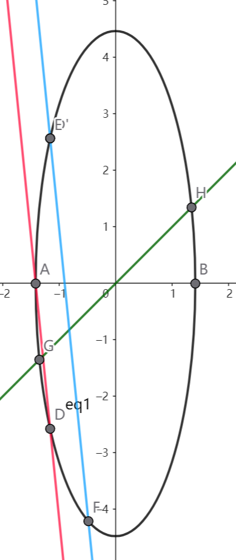
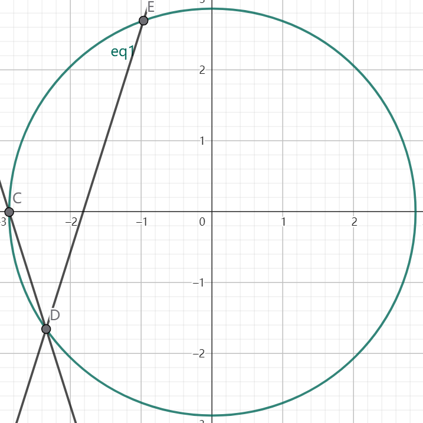
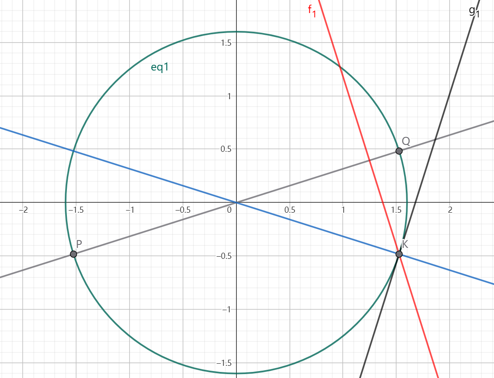

为方便作图示意，我们以 $m_1/m_2=10$ 为例

以 $v_1$ 和 $v_2$ 作为坐标轴建立坐标系，则我们可以用坐标系中的一个点 $(v_1,v_2)$ 来表示两物体当前的运动状态

能量守恒
$$
\frac{1}{2}m_1v_1^2+\frac{1}{2}m_2v_2^2=E\tag{1}
$$
表现为两物体速度的所有可能状态均在一个椭圆上

而动量守恒
$$
m_1v_1+m_2v_2=p\tag{2}
$$
则表现为一条直线

由此，碰撞前后的两物体状态实际上可以用椭圆与直线的两个交点表示

其中 $A$ 代表第一次碰撞前两物体的速度，$D$ 代表第一次碰撞后两物体的速度

而 $m_2$ 与墙壁的碰撞则表现为图中两物体状态由 $D$ 点关于 $v_1$ 轴对称得到 $D'$ 点，图中蓝线则代表了此时的动量守恒式子，其必然与红线平行，$F$ 点则是第二次碰撞后两物体的状态

而终止条件则是 $v_1>v_2>0$ 即两物体的状态处于弧 $HB$ 上

> 下面就是具体计算了，看不看影响不大

------------

------------

------------

考虑到椭圆不太好看，我们做坐标变换 $(v'_1,v'_2)=(\sqrt{m_1}v_1,\sqrt{m_2}v_2)$ 此时有
$$
\begin{aligned}
\frac{1}{2}m_1v_1^2+\frac{1}{2}m_2v_2^2=E &\Rightarrow {v'}_1^2+{v'}_2^2=E\\
m_1v_1+m_2v_2=p &\Rightarrow \sqrt{m_1}v'_1+\sqrt{m_2}v'_2=p\\
v_2=v_1 &\Rightarrow v'_2=\frac{\sqrt{m_2}}{\sqrt{m_1}}v'_1
\end{aligned}
$$
这就给出了新的终止条件，动量守恒的平行线以及能量守恒的圆，此外，我们将对状态点取对称的操作化为对动量守恒的直线斜率取负数的操作，显然二者是等价的，只是需要将终止条件也取一个对称

现在，我们来分析图中线的变化规律：

对 $C,D,E$ 三点我们分别取切线 

令直线 $CD$ 的斜率为 $k$ ，则我们可以清晰的得到
$$
\alpha_\text{初始}=\arctan \abs{k}
$$

$$
\Delta \alpha = \ang CDE = \ang DEG = 2\arctan\abs{k}
$$

我们可以用 $\alpha =\alpha_\text{初始}+n\Delta\alpha$ 来判断两物体是否会再次碰撞

对于终止条件，由于坐标系的变化以及我们对斜率取负的操作，变为
$$
\abs{\frac{v_2}{v_1}}<\frac{\sqrt{m_2}}{\sqrt{m_1}}
$$
即图中的弧 $QK$ 

我们考虑
